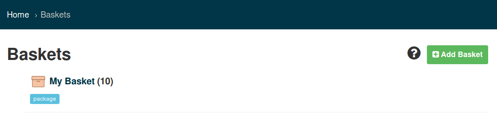
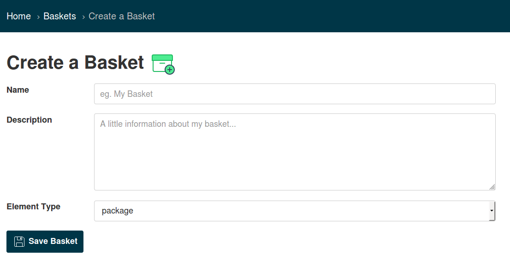
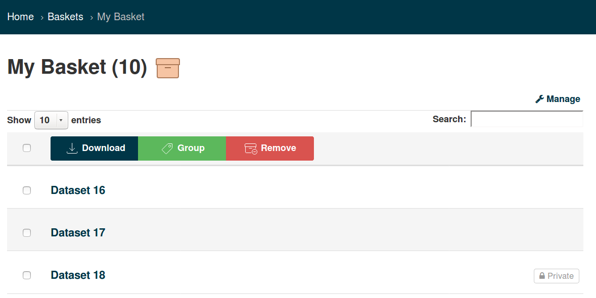
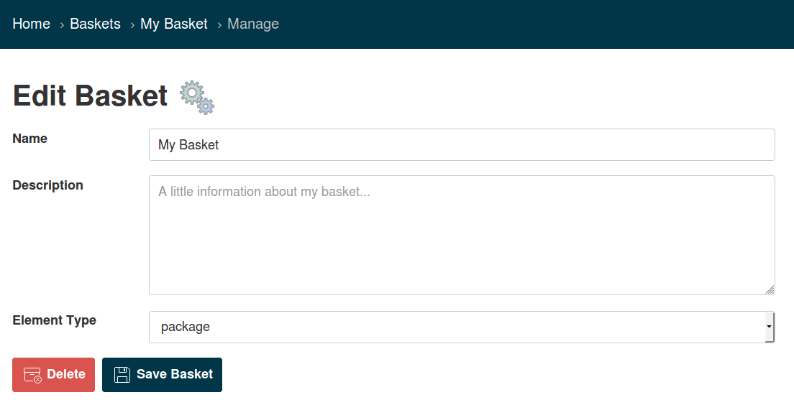
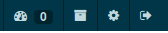

ckanext-basket
=============

This plugin allows users to create baskets. Users can create baskets to memorize and group datasets of special importance. Furthermore, user can download their basket data easily.

Basket symbol in the header:

------------
API functions
------------

You must be logged in in order to use any basket api function.

##### basket_create(context, data_dict)

Create a new basket. Normal users can only create baskets for themselves, thus Parameter "user_id" will be ignored.

**Parameters:**
* **user_id** (string) - The id of the user to create the basket for (only admin)
* **name** (string) - The name of the basket
* **description** (string) - Description of the basket
* **element_type** (string) - The type of the basket elements (e.g. package, resource, subset) (optional)

**Returns:**
the newly created basket.

**Return type:**
dictionary

#### basket_update(context, data_dict):

Update a basket. You can only update your own basket.

For further parameters see basket_create().

**Parameters:**
* **id** (string) - The id of the basket

**Returns:**
the updated basket.

**Return type:**
dictionary

#### basket_purge(context, data_dict):
Purge a basket. You can only purge your own basket.

**Parameters:**
* **id** (string) - The id of the basket

**Returns:**
/

#### basket_list(context, data_dict)
List all baskets for user. Only sysadmins can see other baskets, everyone else can only list his/her own baskets.

**Parameters:**
* **user_id** (string) - The id of the user for whom to list the baskets (only admin)

**Returns:**
a user's baskets.

**Return type**
list of dicts

#### basket_show(context, data_dict)
Show basket with or without its elements. You are only allowed to do a basket_show of your own basket.

**Parameters:**
* **id** (string) - The id of the basket
* **include_elements** (boolean) - default False (optional)

**Returns:**
the requested basket.

**Return type:**
dictionary

#### basket_element_list(context, data_dict)
List all elements in basket. You are only allowed to list elements from your own basket.

**Parameters:**
* **id** (string) - The id of the basket

**Returns:**
a dataset's baskets.

**Return type**
list of dicts

#### basket_element_add(context, data_dict)
Add one or more elements to a basket. You are only allowed to add elements to your own basket.

**Parameters:**
* **basket_id** (string) - The id of the basket
* **packages** (list of strings) - The id of the packages
* **package_id** (string) - The id of the package

**Returns:**
The basket_id and the package_id

**Return type**
dictionary

#### basket_element_remove(context, data_dict):
Remove one or more elements from a basket. You are only allowed to remove elements from your own basket.

**Parameters:**
* **basket_id** (string) - The id of the basket
* **packages** (list of string) - The id of the packages
* **package_id:** (string) - The id of the package

------------
Requirements
------------

------------
Installation
------------

.. Add any additional install steps to the list below.
   For example installing any non-Python dependencies or adding any required
   config settings.

To install ckanext-basket:

1. Activate your CKAN virtual environment, for example::

     . /usr/lib/ckan/default/bin/activate

2. Install the ckanext-basket Python package into your virtual environment::

     pip install ckanext-basket

3. Add ``basket`` to the ``ckan.plugins`` setting in your CKAN
   config file (by default the config file is located at
   ``/etc/ckan/default/production.ini``).

4. Restart CKAN. For example if you've deployed CKAN with Apache on Ubuntu::

     sudo service apache2 reload

---------------
Config Settings
---------------

Document any optional config settings here. For example::

    # The minimum number of hours to wait before re-checking a resource
    # (optional, default: 24).
    ckanext.basket.some_setting = some_default_value

------------------------
Development Installation
------------------------

To install ckanext-basket for development, activate your CKAN virtualenv and
do::

    git clone https://github.com/sureL89/ckanext-basket.git
    cd ckanext-basket
    python setup.py develop
    pip install -r dev-requirements.txt

-----------------
Running the Tests
-----------------

To run the tests, do::

    nosetests --nologcapture --with-pylons=test.ini

To run the tests and produce a coverage report, first make sure you have
coverage installed in your virtualenv (``pip install coverage``) then run::

    nosetests --nologcapture --with-pylons=test.ini --with-coverage --cover-package=ckanext.basket --cover-inclusive --cover-erase --cover-tests

---------------------------------
Registering ckanext-basket on PyPI
---------------------------------

ckanext-basket should be availabe on PyPI as
https://pypi.python.org/pypi/ckanext-basket. If that link doesn't work, then
you can register the project on PyPI for the first time by following these
steps:

1. Create a source distribution of the project::

     python setup.py sdist

2. Register the project::

     python setup.py register

3. Upload the source distribution to PyPI::

     python setup.py sdist upload

4. Tag the first release of the project on GitHub with the version number from
   the ``setup.py`` file. For example if the version number in ``setup.py`` is
   0.0.1 then do::

       git tag 0.0.1
       git push --tags

----------------------------------------
Releasing a New Version of ckanext-basket
----------------------------------------

ckanext-basket is availabe on PyPI as https://pypi.python.org/pypi/ckanext-basket.
To publish a new version to PyPI follow these steps:

1. Update the version number in the ``setup.py`` file.
   See `PEP 440 <http://legacy.python.org/dev/peps/pep-0440/#public-version-identifiers>`_
   for how to choose version numbers.

2. Create a source distribution of the new version::

     python setup.py sdist

3. Upload the source distribution to PyPI::

     python setup.py sdist upload

4. Tag the new release of the project on GitHub with the version number from
   the ``setup.py`` file. For example if the version number in ``setup.py`` is
   0.0.2 then do::

       git tag 0.0.2
       git push --tags
